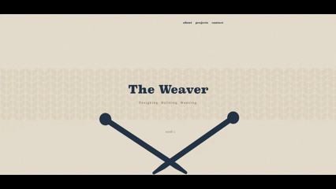
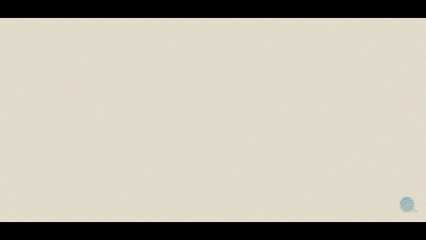
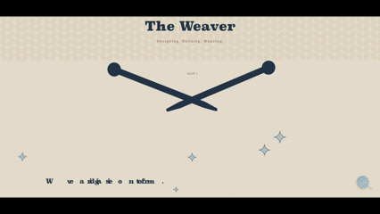
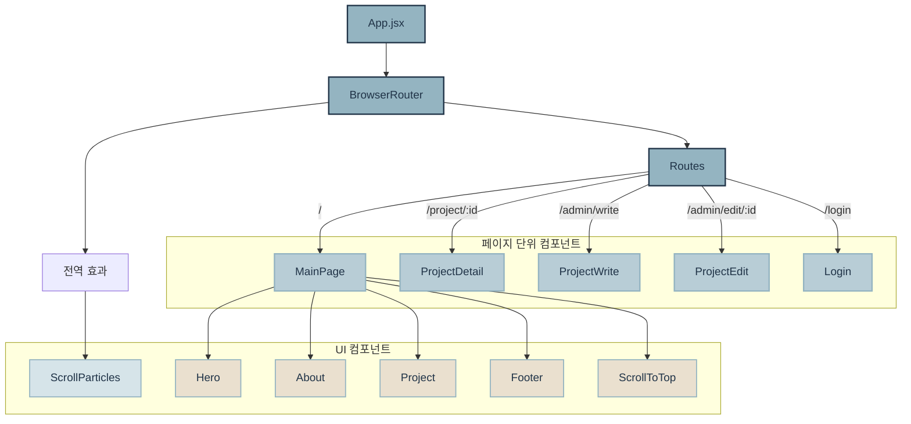

# 🧶 Frontend: The Weaver Interactive UI

> **"Weaving ideas into form."**
> <br><br>
><div align="center">
>  
>  
>  
>  
>  
></div>

> 사용자의 스크롤을 **'실을 엮는 행위'** 로 치환하여, 단순한 포트폴리오 나열을 넘어 몰입감 있는 경험을 설계한 프론트엔드 저장소입니다.

---

## 🖼️ Visual Preview

| Hero Needle Interaction | Scattering & Weaving Text | Particle System |
| :---: | :---: | :---: |
|  |  |  |

---

## ✨ Why I Built This

포트폴리오 사이트를 만들면서 가장 고민한 건 **"어떻게 하면 나라는 사람을 페이지 하나로 보여줄 수 있을까"** 였습니다.

단순히 프로젝트 목록을 나열하는 대신, **스크롤이라는 행위 자체를 서사로 만드는 경험**을 설계했습니다. 뜨개질 바늘이 실을 엮듯, 사용자가 스크롤할수록 이야기가 하나씩 풀려나오는 구조입니다.

디자인 배경과 개발 경험을 동시에 가진 사람으로서, 이 사이트는 그 두 가지를 직접 증명하는 공간이기도 합니다.

---

## 🗺️ Architecture & Routing

React Router 기반의 싱글 페이지 애플리케이션입니다.



```
the-code-weaver-frontend/
├── src/
│   ├── App.jsx              # 최상위 라우팅 및 전역 레이아웃
│   ├── main.jsx             # React 진입점
│   ├── index.css / App.css  # 전역 스타일시트
│   ├── assets/              # 정적 자원 (폰트, 아이콘 등)
│   ├── images/              # 이미지 자원
│   └── components/
│       ├── Hero/            # 메인 인트로 — 바늘 애니메이션
│       ├── About/           # 소개 섹션 — 글자 해체 효과
│       ├── Project/         # 프로젝트 목록 · 상세 · 작성 · 수정
│       ├── Footer/          # "Shall we weave together?"
│       ├── ScrollParticles/ # 전역 스크롤 입자 시스템
│       └── ScrollToTop/     # 위로가기 버튼
```

---

## 🛠️ Tech Stack

| 분류 | 기술 |
|---|---|
| **Framework** |   |
| **Routing** |  |
| **Animation** |   |
| **Styling** |  |

---

## 🕹️ Animation Deep-Dive

### 1. Framer Motion — 물리적 탄성과 상태 제어

**Hero Needle Oscillation**

`useScroll` + `useTransform`을 결합하여 스크롤 속도에 따라 바늘 각도를 실시간으로 변환합니다. `Math.sin(v * 30) * 15` 공식으로 실제 뜨개질 같은 왕복 운동을 구현했습니다.

**Deterministic Random Storytelling**

About 섹션에서 글자들이 해체될 때, React 19의 엄격한 이중 렌더링 환경에서도 일관된 물리 효과를 유지하기 위해 `index` 기반의 **결정론적 랜덤 함수**를 직접 설계했습니다. 순수 난수를 쓰면 렌더링마다 위치가 달라지는 문제가 생겼고, 이를 수학적으로 해결한 부분입니다.

---

### 2. GSAP ScrollTrigger — 정교한 시퀀스 연출

**Velocity-based Particle System**

스크롤 속도(`getVelocity()`)를 실시간 감지해 입자의 종류를 동적으로 분기합니다.

- **스크롤 내려갈 때** → 포근한 털실 입자(Yarn) 생성
- **스크롤 올라갈 때** → 가시성 높은 스파클 별(Star) 생성

단순한 장식이 아니라, 스크롤 방향이라는 사용자 행동을 시각적 피드백으로 번역한 인터랙션입니다.

**Editorial Layout Transition**

ProjectDetail 진입 시 이미지 프레임과 드롭캡(`drop-cap`) 텍스트가 순차적으로 떠오르는 매거진 스타일 전환 효과를 구현했습니다.

---

## ⚡ Performance Optimization

**반응형 애니메이션 조정**
`window.innerWidth`를 감지해 모바일 환경에서 입자 생성 확률과 물리 거리 값을 동적으로 줄였습니다. 감성은 유지하되 모바일 부하를 최소화합니다.

**레이어 클릭 이벤트 보호**
노이즈 텍스처와 애니메이션 레이어가 실제 버튼 클릭을 방해하지 않도록 `pointer-events: none` 처리를 레이어별로 세밀하게 적용했습니다.

---

## 🚀 Quick Start

```bash
# 1. 의존성 설치
npm install

# 2. 로컬 서버 실행
npm run dev
```

> 백엔드 서버가 함께 실행되어야 프로젝트 데이터가 표시됩니다.  
> 백엔드 설정은 → [The Weaver Backend Repository](https://github.com/hoilycat/the-code-weaver-backend)

---

## 🔗 Related

- [Backend Repository](https://github.com/hoilycat/the-code-weaver-backend) — Spring Boot REST API + CMS
- [Live Site](https://the-weaver.vercel.app)
